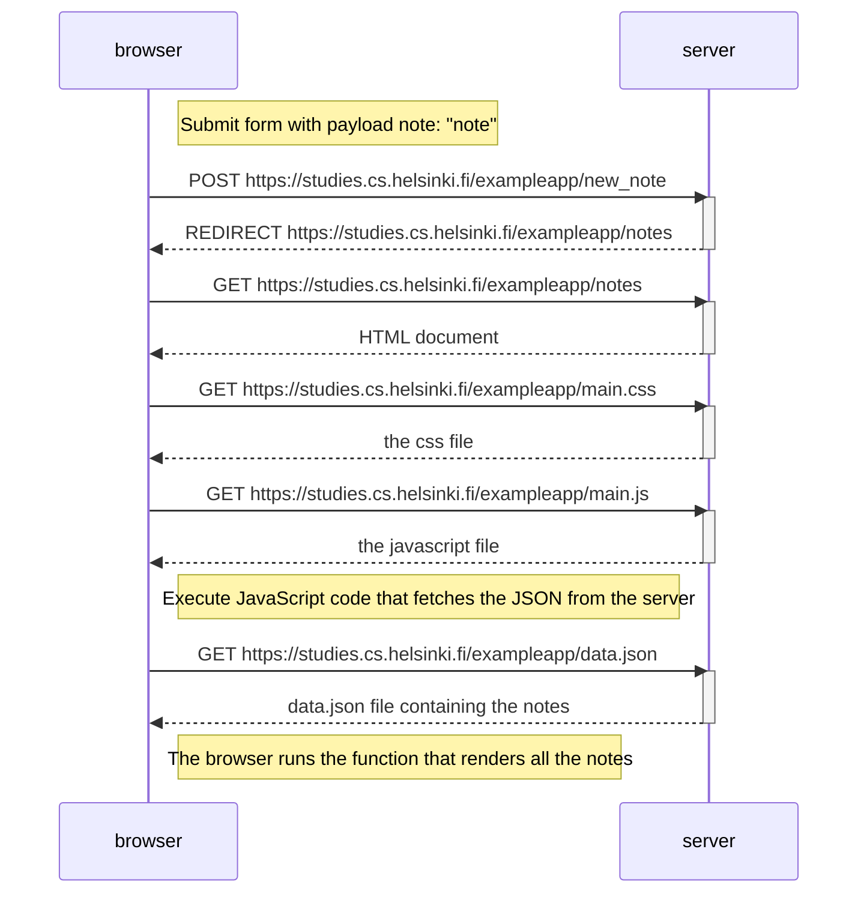

```mermaid
sequenceDiagram
    participant browser
    participant server

    Note right of browser: Submit form with payload note: "note"

    browser->>server: POST https://studies.cs.helsinki.fi/exampleapp/new_note
    activate server
    server-->>browser: REDIRECT https://studies.cs.helsinki.fi/exampleapp/notes
    deactivate server

    browser->>server: GET https://studies.cs.helsinki.fi/exampleapp/notes
    activate server
    server-->>browser: HTML document
    deactivate server

    browser->>server: GET https://studies.cs.helsinki.fi/exampleapp/main.css
    activate server
    server-->>browser: the css file
    deactivate server

    browser->>server: GET https://studies.cs.helsinki.fi/exampleapp/main.js
    activate server
    server-->>browser: the javascript file
    deactivate server

    Note right of browser: Execute JavaScript code that fetches the JSON from the server


    browser->>server: GET https://studies.cs.helsinki.fi/exampleapp/data.json
    activate server
    server-->>browser: data.json file containing the notes
    deactivate server

    Note right of browser: The browser runs the function that renders all the notes
```
