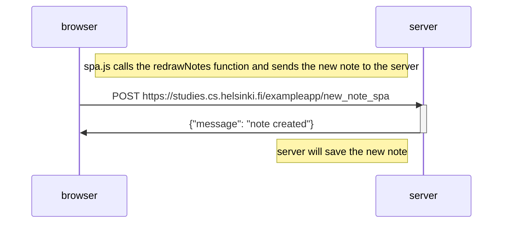

```mermaid
sequenceDiagram
    participant browser
    participant server

    Note right of browser: spa.js calls the redrawNotes function and sends the new note to the server

    browser->>server: POST https://studies.cs.helsinki.fi/exampleapp/new_note_spa
    activate server
    server->>browser: {"message": "note created"}
    deactivate server

    Note left of server: server will save the new note
```
